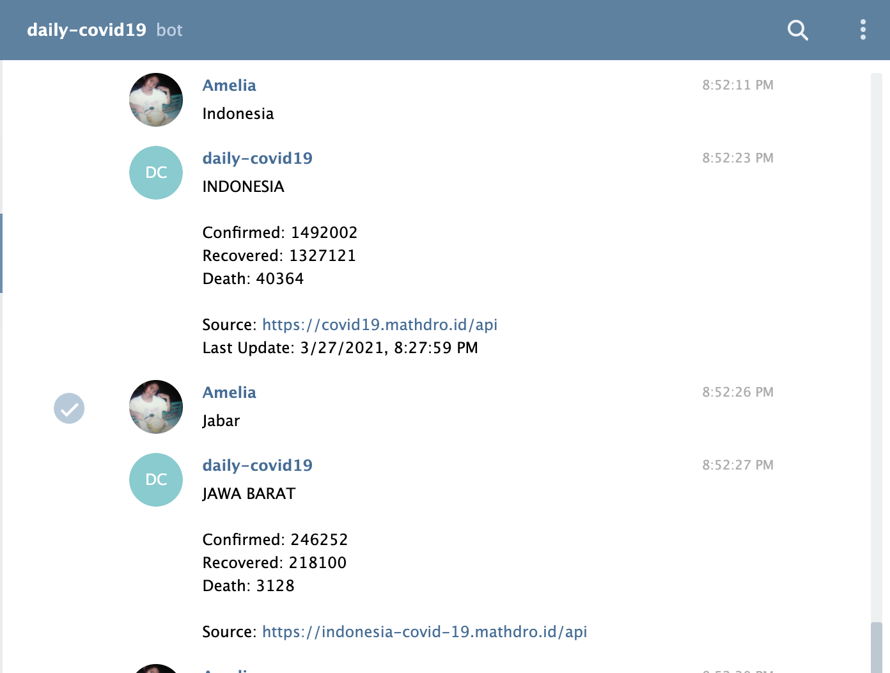

In March 2019, I found a public API that provides information about daily cases of Covid19 around the world. The source API is <a href="https://covid19.mathdro.id/api" target="_top">https://covid19.mathdro.id/api</a>. I thought it would be very useful if there's an application that provided users about the daily update of covid19 cases from that API. So, I decided to create one. The application is a telegram chat bot that allows user to type the name of the country or the name of the province in Indonesia, and the bot will provide the information of the total of confirmed, recovered and death cases of Covid19 in response. The application is built using NodeJS and API Webhook from telegram app. You can try the chat bot via link here <a href="https://t.me/test_covid19news_bot" target="_top">here</a>. 

For example:

