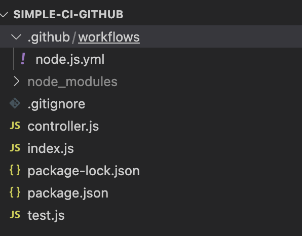

To manage several servers, it's quite time consuming if we need to do deployment one by one on a daily basis of development. I need to build, push images and serve applications manually. Imagine if we have many applications developed, how much time it takes to finish the same activities and steps? 
Then <a href="https://www.linkedin.com/in/fransiskus-teddy/" target="_top">my geek friend</a> taught me to automatically deploy everytime new change is pushed to certain branch using Gitlab CI. At that time, my work is getting easier. I just need to check if the pipeline is successfully runned and the application is already up. But since it's quite long to explain the steps (it's also involved with the gitlab-runner setup on EC2 AWS), I'll write it down in another time :D.

I'm just so curious about how it works on Github. So I decided to figure out how to run CI using Github Action. It's just a simple pipeline to run testing in Express using Mocha Chai.

1. Create simple express application. Do `npm i express` `npm i mocha chai --save-dev` and set it up to run on a certain port.
2. Write simple function that can be called in test file:
   ```
   module.exports = {
    test : () => {
        return "Test CI"
     }
   }
   ```
3. Write simple test file:
   ```
    const { expect } = require('chai')
    const { test } = require('./controller');
    
    describe('Test return Test CI', () => {

    it('Successfully return Test CI', () => {
        const res = test()
        expect(res).to.equal('Test CI')
      })
    })
    ```
4. Setup script to run test on package.json file:
   ```
   "scripts": {
     "start": "node index.js",
     "test": "mocha test.js"
   },
   ```
5. Now, it is time to set up the pipeline. It's really nice that Github already provided the default configuration. You can choose `Actions` tab on your repository and manage your own workflow setup.
Here is mine:
  - Create pipeline file (node.js.yml) on folder `.github/workflows/`
    
  - Write the steps:
    ```
    name: Node.js CI
    
    on:
      push:
        branches: [ "main" ]
      pull_request:
        branches: [ "main" ]
    
    jobs:
      build:
    
        runs-on: ubuntu-latest
    
        strategy:
          matrix:
            node-version: [14.x, 16.x, 18.x]
            # See supported Node.js release schedule at https://nodejs.org/en/about/releases/
    
        steps:
        - uses: actions/checkout@v3
        - name: Use Node.js ${{ matrix.node-version }}
          uses: actions/setup-node@v3
          with:
            node-version: ${{ matrix.node-version }}
            cache: 'npm'
        - name: Install dependencies
          run: npm install
        - name: Running test
          run: npm test
    ```


