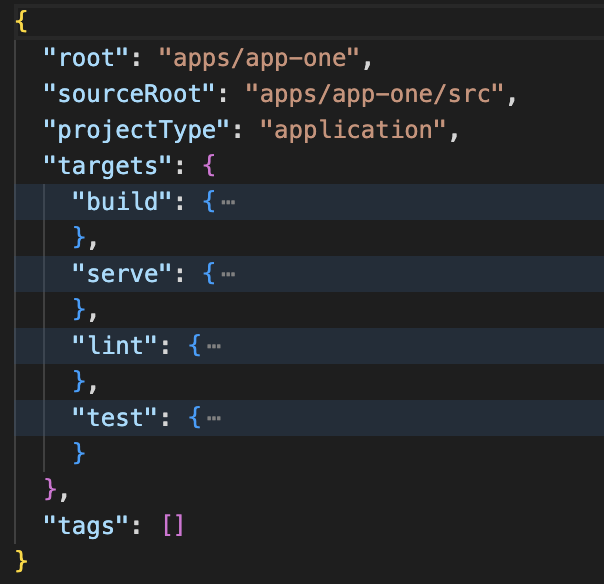

This post is to summarize <a href="https://f.hubspotusercontent20.net/hubfs/2757427/effective-react-with-nx-2022.pdf" target="_top"> a book about monorepo with Nx </a> that I finished recently. But this is only introduction and I took an example for only setting up monorepo with Nx for backend using express with a guide from <a href="https://nx.dev/" target="_top"> the official Nx website </a>. For the note, I might skip some important things from the book, so better to follow that link and later we can discuss furthermore :)

### Monorepo
As quoted from the book, `A monorepo is a single repository containing multiple distinct projects, where we don't just have code collocation, but well defined relationships among these projects.` The keyword is `defined relationship`. If we have some services that somehow are related to each other, monorepo is very useful to use. For example, to adjust linter setting, so each programmer in the team has the same rule about it. Or even to update the library that is used in all applications, we don't need to change one by one if we use monorepo, just one way and every application in the workspace will be updated.

### Set Up
To follow the instruction from the book, we can use Nx with version 13.3.0. We can create workspace with the following command:
```
npx create-nx-workspace@13.3.0
```
*By default, the npx binary comes bundled with NodeJS. It allows you to conveniently install then run a Node binary without the need to install it globally.*

We will be asked to name the workspace and after that we need to choose what type of workspace to build. The workspace name is used by Nx to scope our libraries. 


Let's choose express and then we need to name first application (let's name *app-one*)


In addition, Nx will ask about setting up Nx Cloud2 (Honestly, I haven't researched about this yet, but the book said: Nx Cloud adds remote distributed computation caching and other performance enhancing features to the Nx workspace. Even though it is the commercial addon for Nx, it comes with a generous free tier. So feel free to go ahead and enable it or skip it entirely).

If finished, it will generate workspace foldering like this:


There are Nx specific configuration files:
- nx.json : Located at the root of the workspace and configures the Nx CLI. It allows to specify things such as defaults for projects and code scaffolding, the workspace layout, task runner options and computation cache configuration and more.
- workspace.json: Located at the root and used to list the projects in your workspace explicitly. It is optional.
- project.json: Located at the root of every project in our workspace. It contains targets for invoking a build, serve for serving the app during development as well as targets for linting (lint) and testing (test). These are the ones generated by default, but we are free to add our own as well.


To serve the application, just like running the NodeJS app, we can run `npm start`. And if we navigate to `http://localhost:3333/api`, it will give the response:


How to add another express project? Simply command:
```
npx nx g @nrwl/express:app <application name>
```
It will generate new express application in the workspace:


We can also serve all the applications together using command:
```
npx nx run-many --target=serve --all
```
or only for specified projects:
```
npx nx run-many --target=serve --projects=project1,project2
```

There are still many things to explore, this is just the beginning for me to learn and understand monorepo.