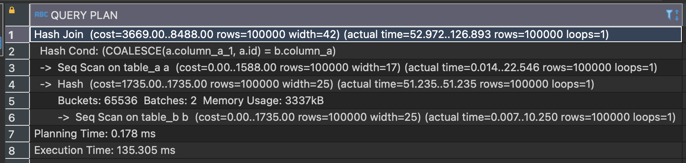

There are times when we need to join a table with a null condition. If `column a` is null, then join it using the condition with `column b`, and vice versa.

Initially, I thought it could be easily done using a `CASE WHEN` expression. However, when dealing with a large data, it poses performance issue.

Let's proceed with the example. 
Create two tables and seed them with 100,000 rows of data:

Seed data using `generate series` for each table. Here, I just add a condition to set table_a with a null value in one column used for the join condition:

On the first attempt, I use `CASE WHEN` expression to fetch the data. When `column_a_1` column is not null then join on condition `column_a_1`, otherwise join with `id` column.

The `EXPLAIN ANALYZE` result is shown in the following image. It takes quite long to execute:

Later, I found out that `COALESCE` expression can also be used for join condition. Referring to <a href="https://www.postgresqltutorial.com/postgresql-tutorial/postgresql-coalesce/" target="_top"> PostgreSQL COALESCE </a>, The COALESCE function accepts an unlimited number of arguments. It returns the first argument that is not null. If all arguments are null, the COALESCE function will return null.
So, here is the full query:

See how the EXPLAIN ANALYZE demonstrates a significant improvement compared to the previous query:

That's it.
