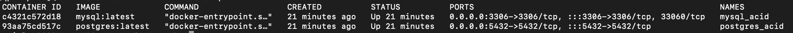
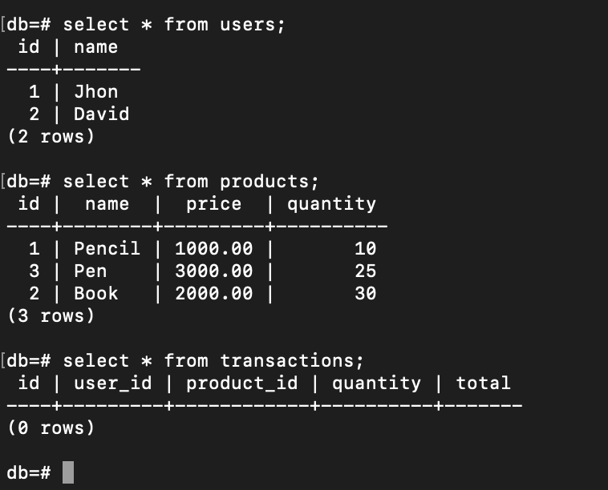
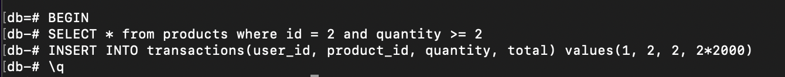
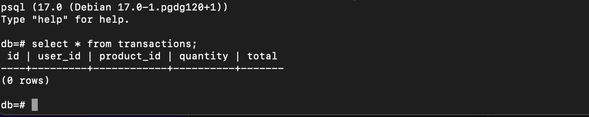

As someone who works with database every single day, it is very useful to understand the four fundamentals that build the database system: `ACID`. 

Recently, I studied about these critical things from  <a href="https://www.udemy.com/course/database-engines-crash-course" target="_top">this very easy to understand course</a> and also other resources, especially from <a href="https://www.postgresql.org/docs/current/" target="_top">PostgreSQL document</a> and <a href="https://dev.mysql.com/doc/refman/8.4/en/mysql-acid.html" target="_top">MySQL document</a>. Practicing and summarizing what I learned in writing helps me remember and understand better.

ACID stands for __`Atomicity, Consistency, Isolation and Durability`__. We may engage with these concepts often in our daily work without realizing it. But before going further, let's start by discussing the term of `Transaction`.

## Transaction

Transaction can be defined as the collection of some queries that run as a single unit of work. This is always handled by the database, whether we explicitly define it in our query or not. It is very crucial to use transaction in our queries, in case our server crashes in the middle of process, as transaction can ensure data persistence and consistency. 

As for part of the transaction:

- Transaction BEGIN: Indicates the start of transaction that includes multiple queries.
- Transaction COMMIT: Commit all the queries in a transaction, write all the changes to disk.
- Transaction ROLLBACK: if something doesn't work or goes wrong in the middle of transaction, then all processes can be undone, return to the previous state.

Let's say we have 3 tables: `users, products, transactions`.

`users`

|id   	|name   |
|---	|---	|
| 1   	| Jhon 	|
| 2 	| David |

`products`

| id | name   | price | quantity |
|--- |---     |---    |---       |
| 1  | Pencil | 1000  | 10       |
| 2  | Book   | 2000  | 30       |
| 3  | Pen    | 3000  | 25       |

`transactions`

| id | user_id | product_id | quantity | total |
|--- |---      |---         |---       |---    |

What to do when user named Jhon buys 2 books?

The typical steps are:
1. Check if the quantity is sufficient.
2. Insert the transaction.
3. Update the product quantity.

```sql
BEGIN

    SELECT * from products where id = 2 and quantity >= 2

    INSERT INTO transactions(user_id, product_id, quantity, total) values(1, 2, 2, 2*2000)

    UPDATE products set quantity = quantity - 2 where id = 2;

COMMIT
```

What if, during a process where the `products` table is being updated, the database suddenly crashes? When it restarts, could the data become inconsistent, because the new data have been already inserted into `transactions`, but `products` table failed to update? This is why we need `Atomicity` in such cases.


## Atomicity

Atomicity means that all queries within a transaction are treated as a single atom that cannot be split. Regardless of the number of queries —whether it’s one or a hundred— all of them must succeed. And if any one query fails, all previously successful queries must rollback. 

So, if we look at the example above, if query to update `products` table fails before commiting, even the insert query is successfull, all processes must be rolled back.

Let's jump into practice. I already have 2 docker containers run in my local computer. You can follow this setup: <script src="https://gist.github.com/ameliarahman/f338e22b8cb75648486084f74ede6292.js"></script>

Here is my `docker ps` result:



And I already inserted data in PostgreSQL database as in the example:



Now let's make a new transaction where Jhon buys 2 books. But before I update the `products` table, I close the connection from within the container by typing `\q`



I go to the container again to check if there is any new row in `transactions` table. But there's still nothing:


That's what `Atomicity` transaction means, from begin to commit is an atom. Even though I have already typed the insert query for the transactions table, it hasn't been committed yet, so the entire process should rollback.

## Isolation

Each DBMS implements isolation level differently. But to understand `Isolation`, consider a scenario where a hundred concurrent users are trying to read from or write to the same table in database. In such cases, could one transaction be affected by others? Or could we ensure that our transaction remains isolated, even with new data being inserted or changed? This is where the concept of isolation becomes crucial. 

There are some `Read Phenomenas` and `Isolation Levels` that we need to know:

### Read Phenomenas
Here are 4 read phenomenas that may happen in an isolation transaction:

#### Dirty Reads
This phenomena occurs when a transaction reads data that has been written by another concurrent transaction, even if that data is not yet successfully committed. This is just scary, as it may lead to incorrect and inconsistent data, since that transaction could rollback.

#### Non-Repeatable Reads
Second phenomena is Non-Repeatable Reads. This occurs when a transaction reads `the specific row` on repeat, but the value changes as other committed transaction modified that row after the first read.

#### Phantom Reads
Phantom Reads happens when a transaction reads `the set of rows`, but when we attempt to read them again, the new row(s) have been added or the existing row(s) have been deleted by other committed transaction. 

#### Lost Updates
This phenomena occurs when we attempt to write something to a table, but upon selecting the data we have already modified, we lost our changes because other transaction also modified the same table.


### Isolation Levels

#### Read Uncommitted
As the name suggests, a transaction at this level can read all data that has not yet been committed by other transactions. In result, `Read Uncommitted` allows `Dirty Reads` to occur.

#### Read Committed
A transaction can only read data from other transactions that have been successfully committed.

#### Repeatable Read
At this level, a transaction ensures that if a query is executed multiple times, it will always return the same data, even though there are many committed data from other transactions.

#### Snapshot
It's like a snapshot version of our database at that moment. We can only read the changes that have been committed up to the time of `transaction begin`.

#### Serialization
At this isolation level, all the transactions will be serialized as if they are executed in order.

### Consistency
Consistency can be defined in 2 definition:

#### Consistency in Data
Consistency in data can be defined by the user who designs the data model and schema. It includes defining the constraint, rules and also relationship between tables. For example, if a column in one table becomes a foreign key in another table and is modified, then that referred foreign key column must also be updated (referential integrity).

#### Consistency in Reads
Consistency in reads means that if a column is modified in one transaction, the changes are immediately visible to other transactions. We always get the recent changes, no matter how many transactions are being committed.

### Durability
Durability in transaction means that every transaction we execute in database is always durable even we lost power or even our database suddenly crashes. If we write something on disk, the data will always be there.

There are some durability techniques:

#### WAL - Write Ahead Log
#### Asynchronous Snapshot
#### AOF - Append-Only File