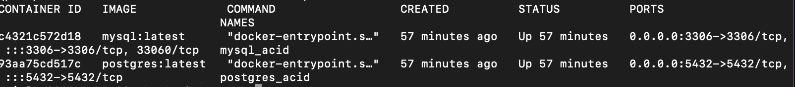
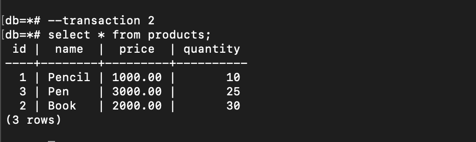

As someone who works with database every single day, it is very useful to understand the four fundamentals that build the database system: `ACID`. 

Recently, I studied about these critical things from  <a href="https://www.udemy.com/course/database-engines-crash-course" target="_top">this very easy to understand course</a> and also other resources, especially from <a href="https://www.postgresql.org/docs/current/" target="_top">PostgreSQL document</a> and <a href="https://dev.mysql.com/doc/refman/8.4/en/mysql-acid.html" target="_top">MySQL document</a>. Practicing and summarizing what I learned in writing helps me remember and understand better.

ACID stands for __`Atomicity, Consistency, Isolation and Durability`__. We may engage with these concepts often in our daily work without realizing it. But before going further, let's start by discussing the term of `Transaction`.

## Transaction

Transaction can be defined as the collection of some queries that run as a single unit of work. This is always handled by the database, whether we explicitly define it in our query or not. It is very crucial to use transaction in our queries, in case our server crashes in the middle of process, as transaction can ensure data persistence and consistency. 

As for part of the transaction:

- Transaction BEGIN: Indicates the start of transaction that includes multiple queries.
- Transaction COMMIT: Commit all the queries in a transaction, write all the changes to disk.
- Transaction ROLLBACK: if something doesn't work or goes wrong in the middle of transaction, then all processes can be undone, return to the previous state.

Let's say we have 3 tables: `users, products, transactions`:

`users`

|id   	|name   |
|---	|---	|
| 1   	| Jhon 	|
| 2 	| David |

`products`

| id | name   | price | quantity |
|--- |---     |---    |---       |
| 1  | Pencil | 1000  | 10       |
| 2  | Book   | 2000  | 30       |
| 3  | Pen    | 3000  | 25       |

`transactions`

| id | user_id | product_id | quantity | total |
|--- |---      |---         |---       |---    |
|    |         |            |          |       |

What to do when user named Jhon buys 2 books?

The typical steps are:
1. Check if the quantity is sufficient.
2. Insert the transaction.
3. Update the product quantity.

```sql
BEGIN

    SELECT * from products where id = 2 and quantity >= 2

    INSERT INTO transactions(user_id, product_id, quantity, total) values(1, 2, 2, 2*2000)

    UPDATE products set quantity = quantity - 2 where id = 2;

COMMIT
```

What if, during a process where the `products` table is being updated, the database suddenly crashes? When it restarts, could the data become inconsistent, because the new data have been already inserted into `transactions`, but `products` table failed to update? This is why we need `Atomicity` in such cases.


## Atomicity

Atomicity means that all queries within a transaction are treated as a single atom that cannot be split. Regardless of the number of queries —whether it’s one or a hundred— all of them must succeed. And if any one query fails, all previously successful queries must rollback. 

So, if we look at the example above, if query to update `products` table fails before commiting, even the insert query is successfull, all processes must be rolled back.

Let's jump into practice. I already have 2 docker containers run in my local computer. You can follow this setup: <script src="https://gist.github.com/ameliarahman/f338e22b8cb75648486084f74ede6292.js"></script>

or simply try this command in the terminal:

```bash
docker run --name postgres_acid -d -e POSTGRES_PASSWORD=postgres -e POSTGRES_DB=db -e POSTGRES_USER=user postgres:latest

docker run --name mysql_acid -d -e MYSQL_PASSWORD=password -e MYSQL_DATABASE=db -e MYSQL_USER=user -e MYSQL_ROOT_PASSWORD=password mysql:latest
```

Here is my `docker ps` result:



And I already inserted data in PostgreSQL database as in the example:


Now let's make a new transaction where Jhon buys 2 books. But before I update the `products` table, I quit the database container:


I go into the container again to check if there is any new row in `transactions` table. But there's still nothing:


That's what `Atomicity` transaction means, from begin to commit is a single atom. Even though I have already inserted data into the transactions table, it hasn't been committed yet. So, when a thing goes wrong with the database, the entire process should rollback.

## Isolation

Each DBMS implements isolation level differently. But to understand `Isolation` better, consider a scenario where a hundred concurrent users are trying to read or to write to the same table in database. In such cases, could one transaction be affected by others? Or could we ensure that our transaction remains isolated, even with new data being inserted or modified? This is where the concept of isolation becomes crucial. 

There are some `Read Phenomena` and `Isolation Levels` that we need to know:

### Read Phenomena
Here are 4 read phenomena that may happen in an isolation transaction:

#### Dirty Reads
This phenomena occurs when a transaction reads data that has been inserted or modified by another concurrent transaction, even if that data is not yet successfully committed. 

This is just scary, as it may lead to incorrect and inconsistent data when rollback happens.

#### Non-Repeatable Reads
Second phenomena is Non-Repeatable Reads. This occurs when a transaction reads `the specific row` on repeat, but then the value changes as other committed transaction modified that specific row before we try to re-read within the same transaction.

#### Phantom Reads
Phantom Reads happens when a transaction reads `the set of rows`, but before we attempt to read them again, the new rows have been added or the existing rows have been deleted by other committed transaction, so the result of the set of rows changed. 

#### Lost Updates
This phenomena occurs when we attempt to write something to a table, but upon selecting the data we have already modified, we lost our changes because other transaction also modified the same table.

### Isolation Levels
There are 5 isolation levels discussed in the course. But basically there are four standard transaction isolation levels without `Snapshot` level:

#### Read Uncommitted
As the name suggests, a transaction at this level can read all data that has not yet been committed by other transactions. In result, `Read Uncommitted` allows `Dirty Reads` to occur.

#### Read Committed
A transaction can only read data from other transactions that have been successfully committed.

#### Repeatable Read
At this level, a transaction ensures that if a query is executed multiple times, it will always return the same data, even though there are many committed data from other transactions.

#### Snapshot
It's similar to `Repeatable Read`, like a snapshot version of our database at that moment. We can only read the changes that have been committed up to the time of `start of transaction`.

#### Serializable
At this isolation level, all the transactions will be serialized as if they are executed in order.

Let's try one by one both in PostgreSQL and MYSQL.

### Read Uncommitted Example
#### PostgreSQL - Read Uncommitted
First, let's check what kind of isolation level in our PostgreSQL database:


It's on `read committed` level.

Now, let's change the isolation mode refers to  <a href="https://www.postgresql.org/docs/current/sql-set-transaction.html" target="_top">PostgreSQL documentation about transaction mode</a>:


During the transaction, I executed a query to select all from the product list. After that, I initiated a new `READ UNCOMMITTED` transaction in another terminal:


Next, I return to the `transaction 1` and executed an update query on the price of `Pencil`:


The price has changed. But will it be the same in the `transaction 2` even it's not fully committed?



The price of pencil remains unchanged!!! So, `read uncommitted` level doesn't occur in this case. WHY?

If we check again to <a href="https://www.postgresql.org/docs/current/transaction-iso.html" target="_top">PostgreSQL documentation</a>, it's already stated there : _`In PostgreSQL, you can request any of the four standard transaction isolation levels, but internally only three distinct isolation levels are implemented, i.e., PostgreSQL's Read Uncommitted mode behaves like Read Committed.`_

Well, we don't need it anyway, do we?

Now, let's try the same steps in MySQL:

#### MySQL - Read Uncommitted
Let's check on what level we currently are:


We are on `Repeatable Read` isolation level. And now let's change the mode to `Read Uncommitted`


Do the same in other terminal for new transaction:


Execute update price of the pencil in `transaction 1`:


Let's return to `transaction 2`

The price of pencil has already changed to 15,000 even I'm not committed yet the `transaction 1`. 

How if I do rollback in `transaction 1` and execute select products query again in `transaction 2`:


It became inconsistent😱😱😱, because the data go back to previous state. Isn't this `Dirty Reads` phenomena scary?!

There are also some DBMS support the `READ UNCOMMITTED` except MySQL, but I haven't tried it one by one.

### Read Committed Example
To check this isolation level, let's do these steps:

1. Change mode of isolation level to `READ COMMITTED`
2. Create 2 concurrent transactions
3. Do update in transaction 1
4. Execute select in both transaction 1 and transaction 2
5. Do commit in transaction 1
6. Execute select again in both transaction and see the difference.

This is the result until step 4. The data has not changed in `transaction 2` both in PostgreSQL and MYSQL if the syntax `COMMIT` is not executed yet in `transaction 1`:

#### PostgreSQL


#### MySQL


So, the `Read Committed` level prevents `Dirt Reads` phenomena to happen. But how about `Non-Repeatable Reads` and `Phantom Reads`? Let's continue the steps, `commit transaction 1`:

#### PostgreSQL


#### MySQL


If we try to execute the same query as before, the data has already changed in `transaction 2`.
That's what we called as Non-Repeatable, as stated in PostgreSQL document Non-Repeatable means `A transaction re-reads data it has previously read and finds that data has been modified by another transaction (that committed since the initial read).`

The difference is that `Phantom Reads` occurs when the result set of rows changes due to concurrent transactions, while `Non-Repeatable Reads` happens with specific rows that have been modified by other transactions.


Before committing the `transaction 1`, the data that met the condition was 3 both in transaction 1 and 2. However, after committing it, the result set of rows changed to only 2 rows. That is Phantom Reads.

### Repeatable Reads Example
Do the same steps, but change to `REPEATABLE READS` mode.


No matter how many times I re-read the same table in `transaction 2` after committing `transaction 1`, the value doesn’t change, it's not affected at all, it's fully isolated from other concurrent transactions. That is `Repeatable Reads`.

But, what happen if I execute update of transactions in circular dependency? `Transaction 1` updates data a to data b, while `Transaction 2` modifies data b to data a. Let's say I have new table named `keys` with the column id and name. And I do transaction in `Repeatable Reads` isolation level.


Even though there is a change in position, the returned set of rows remains the same: Each count of `Key a` and `Key b` is 2. However, this is not as expected because we want it as serialization transaction.

Now, let's try `Serializable` to check if this thing could be prevented:

### Serializable Example
Change isolation level to `SERIALIZABLE`, and do the same thing as before:


PostgreSQL cannot let us to commit such thing on the `Serializable` level with the reason: `Canceled on identification as a pivot, during conflict out checking.` If we still want to execute that, we need to retry the transaction again. That's how `Serializable` works.

The following table summarizes the impact of transaction isolation levels on read phenomena:

| Isolation Level   | Dirty Reads |Lost Updates  | Non-Repeatable Reads | Phantom Reads |
|---                |---          |---           |---                   |---            |
| Read Uncommitted  | ✔️           | ✔️            | ✔️                    | ✔️             |
| Read Committed    | X           | ✔️            | ✔️                    | ✔️             |
| Repeatable Read   | X           | X            | X                    | ✔️             |
| Serializable      | X           | X            | X                    | X             |

## Consistency
Consistency can be defined in 2 definition:

### Consistency in Data
Consistency in data can be defined by the user who designs the data model and schema. It includes defining the constraint, rules and also relationship between tables. For example, if a column in one table becomes a foreign key in another table and is modified, then that referred foreign key column must also be updated (referential integrity).

#### Consistency in Reads
Consistency in reads means that if a column is modified in one transaction, the changes are immediately visible to other transactions. We always get the recent changes, no matter how many transactions are being committed.

## Durability
Durability in transaction means that every transaction we execute in database is always durable even we lost power or even our database suddenly crashes. If we write something on disk, the data will always be there.
