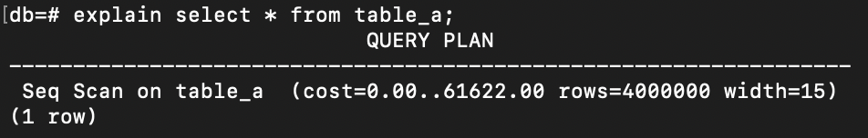
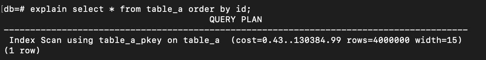
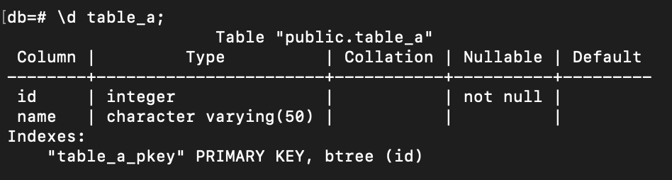
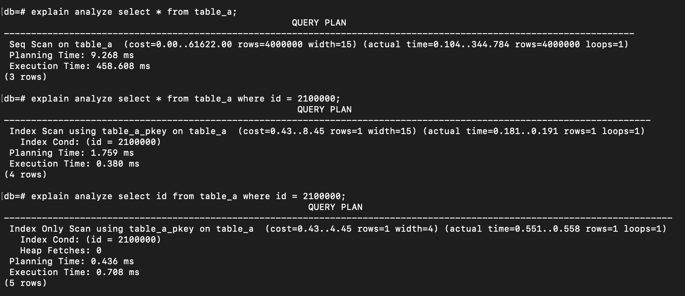
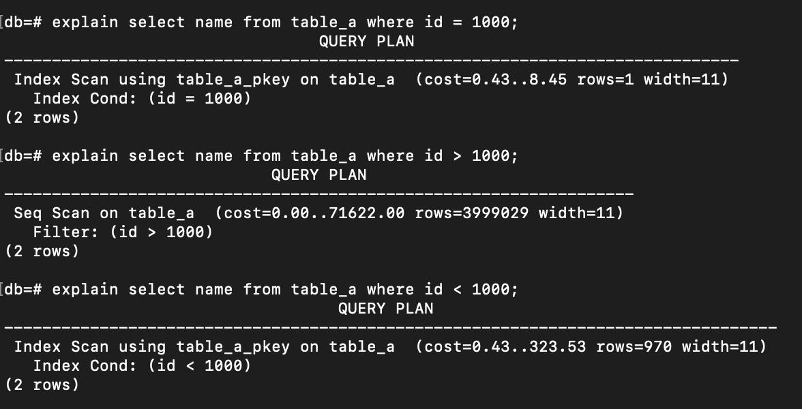

When juggling with a large of data, it is really crucial to know what the database decided to execute our query for optimal performance. Moreover, if we have created index on our data, we need to know whether our query is affected by the index or not? If in the fact the created index doesn't have any affect, we should identify how to improve or to modify the query.

In PostgreSQL, I typically use `EXPLAIN` syntax to analyze the query execution plan chosen by the database. Previously, I only checked the execution time to see how long my query took, but I didn’t fully understand the other descriptions provided. So in this section, - just like <a href="https://ameliarahman.github.io/2024-09/ACID-database" target="_top">the previous writing</a> - I continue to summarize what I have already learned about SQL Planner.

Before we jump into practice, let's discuss first about `page` and `heap` in database.

## Page
Typically, when a database reads or writes data, it operates on pages, not on individual rows Page is fixed-size block of data used by the database to store information. Each page can fit many rows. Each DBMS has default page, in PostgeSQL the default page is 8 KB (You can observe this in your database client when an empty table is created, as it will show a size of 8 KB). For example, if we have 1001 data rows and each page contains 4 rows, then the database has 1001/4 ~ 251 pages. We can use this query to retrieve the information about estimated number of pages and rows:

```sql
    SELECT relpages, reltuples FROM pg_class WHERE relname = 'table_name';
```

## Heap
A heap is collection of pages that represent points to data table. Heap includes everything about table. When a data is inserted into a table, it is stored in the heap.


Now, let's discuss about `EXPLAIN` command in PostgreSQL:

```sql
EXPLAIN [ ANALYZE ] [ VERBOSE ] statement
```

Stated from PostgreSQL documentation:
- EXPLAIN: Show the execution plan of a statement.
- ANALYZE: Carry out the command and show the actual run times (__Keep in mind that the statement is actually executed when ANALYZE is used__)
- VERBOSE: Show the full internal representation of the plan tree, rather than just a summary. Usually this option is only useful for specialized debugging purposes.


Let's prepare the data in the database:

```sql
CREATE TABLE table_a (
    id integer not null primary key,
    name varchar
)
```

I insert the data use `generate_series` until to 4000000 data.

```sql
insert into table_a(id, name) 
SELECT generate_series(1, 4000000), 'Name' || generate_series(1, 4000000)::text;
```

Then let's play the query and see what's the database choose to plan:

```sql
explain select * from table_a;
```
And here is the result of command above:


Before discussing about scanning types, there are 3 outputs that usually shown :

- **Cost**:: Always has 2 numbers seperated by 2 dots. The first number (0.00) represents `Estimated start-up cost`, which indicates how many milliseconds database takes to fetch the first page approximately. In this case, it's 0.00, meaning it cost almost nothing to get the initial result. But if this number increases, that indicates the database has to do a lot of stuff before fetching the result.  Let's try ordering the query above by id:    
    ```sql
    explain select * from table_a order by id;
    ```

    See the difference of the start-up cost:
    
     . 
     
     Even though the difference is not significant (as it’s affected by the index — the primary key has an index by default) , but the database still needs to do a task before fetching the result. 
    
    The second number (61622.00) is the `Estimated total cost`, showing the estimated total time to finish fetching all data.

- **Rows**: `Estimated number of rows`, means the estimation of number of rows in the result.

- **Width**: `Estimated average width`, which is the estimation of width of output row in bytes. So, it's highly recommended to select only what is needed in the query (not select *) to minimize the width of the returned data.

***REMEMBER that the cost, rows and width in `EXPLAIN` is just an estimation, not the actual data***

Now, let's try to add `ANALYZE` after `EXPLAIN` command. This command executes the query:
```sql
explain analyze select * from table_a;
```
```sql
explain analyze select * from table_a where id = 2100000;
```
```sql
explain analyze select id from table_a where id = 2100000;
```
And the result:


- **Actual Time**: This means the actual time of executing the query.

- **Loops**: How many times that step was repeated.

- **Planning Time**: Time for database to plan and to decide what to do with the query. For example: what kind of scan to execute it.

- **Execution Time**: This is the actual work to go and do the work.

- **Heap Fetches**: In the third query, we can see that the data has a value of 0, meaning the query only accesses the index because that is the only thing being selected. The database does not need to go to the heap (where all the detail information for id = 2100000 exist) since the id is already presented in the index.

## Sequential Scan
If we look from the first example result, there is stated `Seq Scan on table a`. Sequential Scan is the same as `Full Table Scan`, it's just the terminology in PostgreSQL. This means that the database decides to read the entire pages to get the desired data.

## Indexing Scan
Indexing in a database can be illustrated using the analogy of a dictionary. In a dictionary, the words are indexed by the alphabet. When you need to check a word that starts with certain letter, you can quickly jump to the section, rather than checking each page one by one.

Now, let's try 3 different queries and see what the database decides to plan:

```sql
explain select name from table_a where id = 1000;
```
```sql
explain select name from table_a where id < 1000;
```
```sql
explain select name from table_a where id > 1000;
```

And here is the result:
. 

When the data consists of only a small set of rows, the database decides to use the `Index Scan`. However, in the second query where the estimated number of rows is a large (see the estimated result is more than 3 million rows. PostgreSQL has the statistic that calculates this estimation. We can run `ANALYZE` to update the statistic after modifying data), the database switches back to using a `Sequential Scan`. In this case, scanning the index and checking each row to see if it meets the condition is way more expensive than simply scanning all pages and filtering out the unnecessary rows.

## Bitmap Scan


