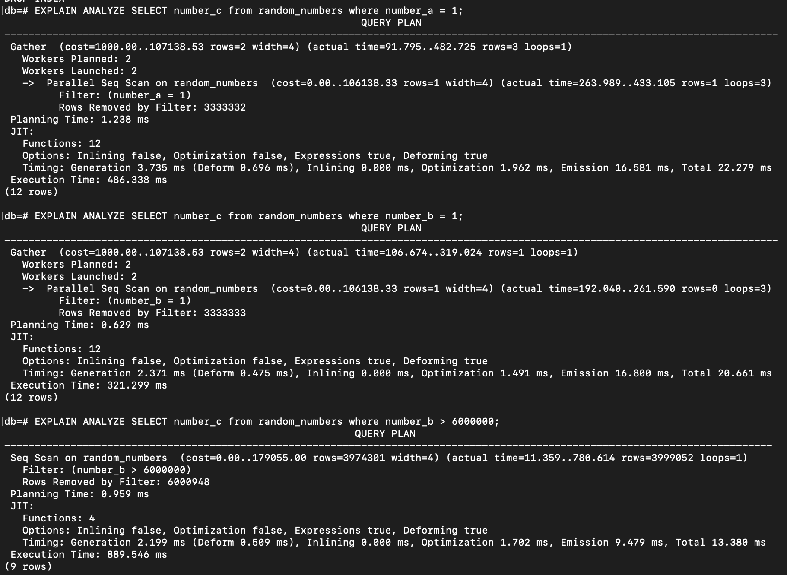
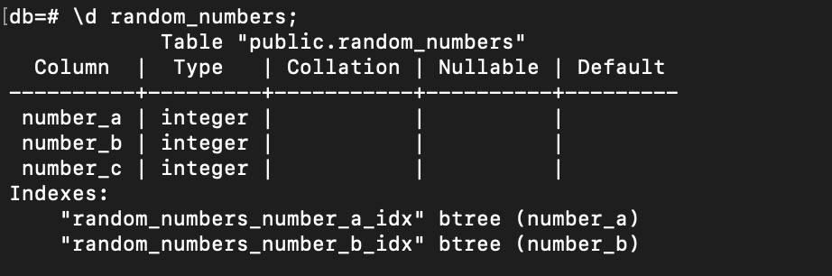
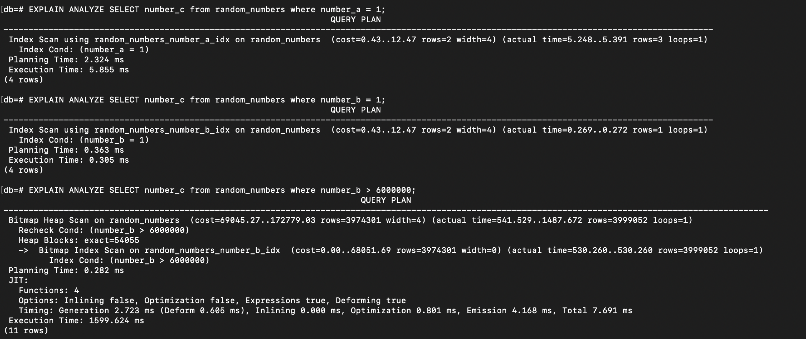
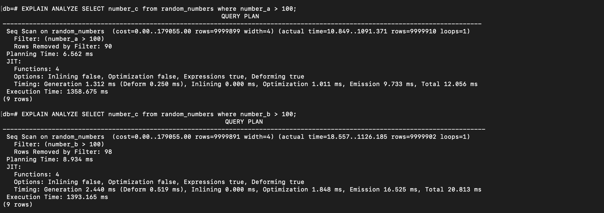
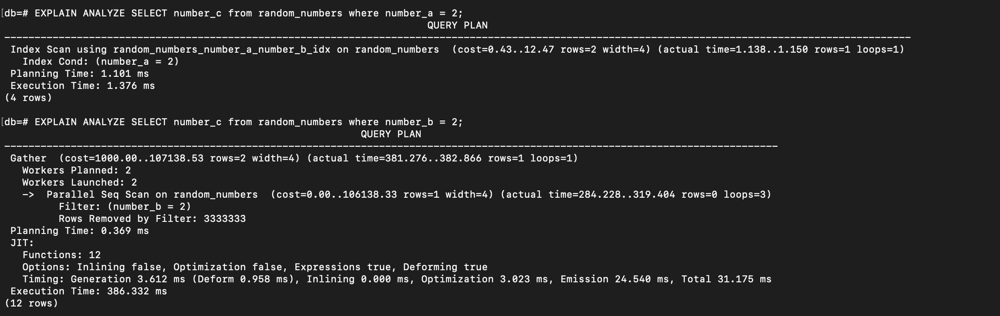
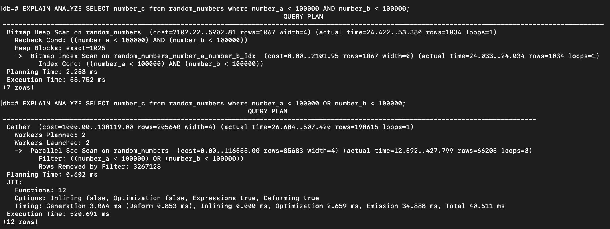
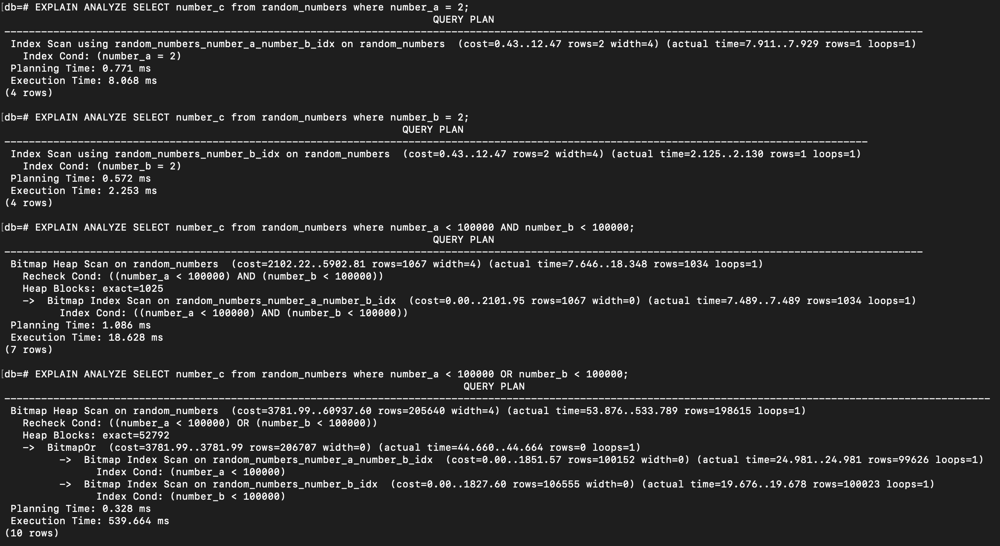

One effective way to improve query performance is by using indexing. After summarizing the query planner, including the explanation about scan type used by the database<a href="https://ameliarahman.github.io/2024-10/Explain-Postgres" target="_top"> in the previous article </a>, this section provides a brief overview of methods for creating indexes to enhance performance in PostgreSQL.

Let’s dive straight into the practice.

Create a table with 3 columns and seed them with million of data as usual:
<script src="https://gist.github.com/ameliarahman/ccf0d74fc24ab2764783ec03750a5ca5.js"></script>

Then run these queries below with `EXPLAIN ANALYZE` before select statement:

```sql
-- Query 1
EXPLAIN ANALYZE SELECT number_c from random_numbers where number_a = 1;

-- Query 2
EXPLAIN ANALYZE SELECT number_c from random_numbers where number_b = 1;

-- Query 3
EXPLAIN ANALYZE SELECT number_c from random_numbers where number_b > 6000000;
```

From the result below, we can check that the database decides to use Sequential Scan for all queries since the table has no index at all:


Now, let's try to create various indexes for the column and see the difference:

## Single Indexing
A single index is the index that is created on one specific column of a table.
For example, if we want to create an index for each `number_a` and `number_b`, we typically can do:
<script src="https://gist.github.com/ameliarahman/2dccde3545b12b740c15589f0a2578c8.js"></script>

And if we check to the table, now we already have btree index on each `number_a` column and `number_b` column:


If we re-run again the queries above, now the database uses the created index during execution:


However, as I ever mentioned in <a href="https://ameliarahman.github.io/2024-10/Explain-Postgres" target="_top"> this article </a>, it’s also important to always remember that even if an index is already created on a column, the database may not use it if the number of rows returned is too large. For example:

```sql
-- Query 1
EXPLAIN ANALYZE SELECT number_c from random_numbers where number_a > 100;

-- Query 2
EXPLAIN ANALYZE SELECT number_c from random_numbers where number_b > 100;
```
And here is the result:


Both queries returned more than 9 millions of data. So, using Sequential Scan is way more efficient than using the index scan to find the data that matches criteria in such case.

## Composite Indexing
If single index is used for a specific field, the composite index is an index that concatinates two or more columns from a table. It’s especially useful when a query involves conditions on two or more columns. However, __`the order of the column matters`__ on the composite index.

Now, let's drop those indexes and create a composite index on number_a and number_b:
<script src="https://gist.github.com/ameliarahman/b2ead7827af6b82fcc66f49701b7ccb7.js"></script>

Then run these queries:

```sql
-- Query 1
EXPLAIN ANALYZE SELECT number_c from random_numbers where number_a = 2;

-- Query 2
EXPLAIN ANALYZE SELECT number_c from random_numbers where number_b = 2;

-- Query 3
EXPLAIN ANALYZE SELECT number_c from random_numbers where number_a < 100000 AND number_b < 100000;

-- Query 4
EXPLAIN ANALYZE SELECT number_c from random_numbers where number_a < 100000 OR number_b < 100000;
```

Here is the result:




If we check on the analyze result above, since I created a composite index with `number_a` as the first key and `number_b` as the second, the index cannot be used to filter only on the `number_b` column (indicated by Parallel Sequential Scan chosen by the database for Query 2). This is because the order of columns in a composite index matters. As stated in <a href="https://ameliarahman.github.io/2024-10/Explain-Postgres" target="_top"> Postgres Documentation </a>:

_A multicolumn B-tree index can be used with query conditions that involve any subset of the index's columns, but the index is most efficient when there are constraints on the leading (leftmost) columns. The exact rule is that equality constraints on leading columns, plus any inequality constraints on the first column that does not have an equality constraint, will be used to limit the portion of the index that is scanned_.

Leading (leftmost) columns refer to the columns listed first when we create the composite index. So, in this case is column `number_a`.

Another observation from the result picture above is that the index is not used for an `OR` condition, as the database executes the query using a Sequential Scan, even though the set of rows is not too large.

Now, let's try to create another single index on `number_b` alone and see the result again:


All the queries are affected by the index. Even for an `OR` condition, the database chooses to use a Bitmap Index Scan, with both the composite index on `(number_a, number_b)` and the single index on `number_b` to execute the query.

Of course, there are still other ways to enhance performance by using indexing, as well as by understanding how the database query planners and optimizers make decisions based on the data, query structure, and other factors. This knowledge can help determine when to add an index and whether to use a single index, a composite index, or even a combination of both to achieve optimal performance.