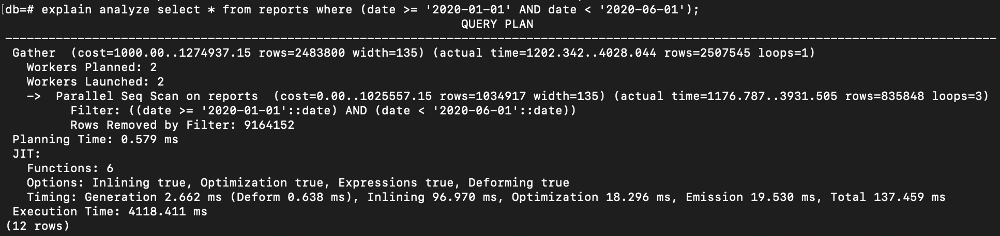
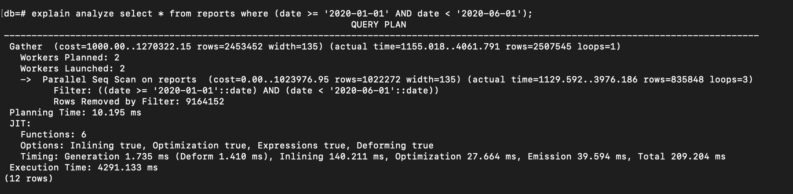
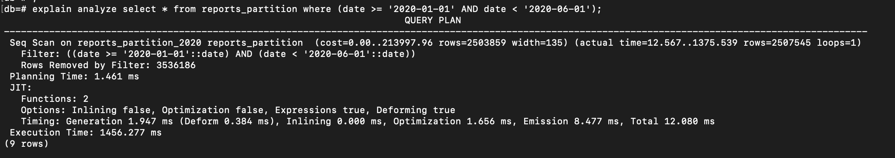
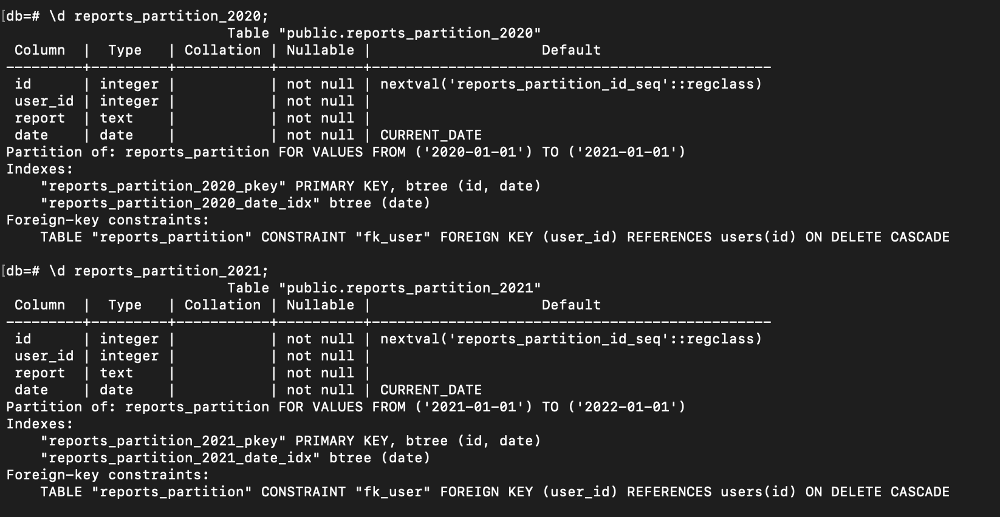
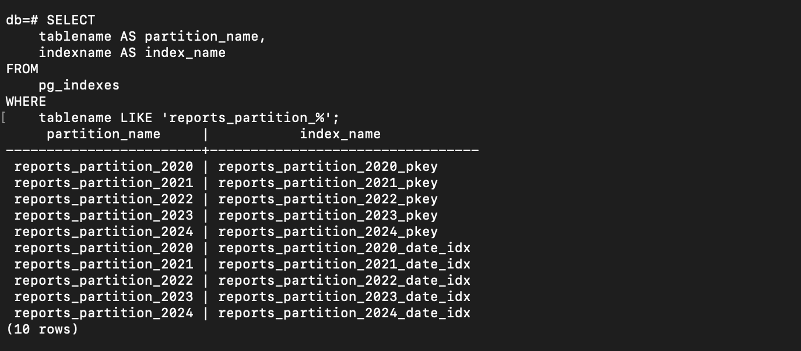
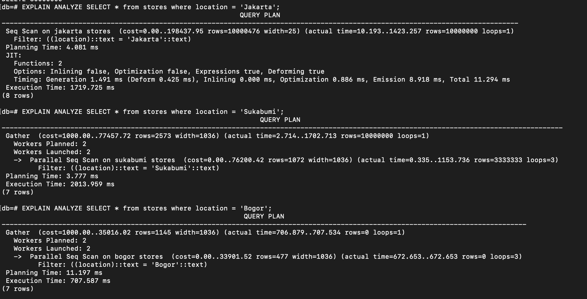
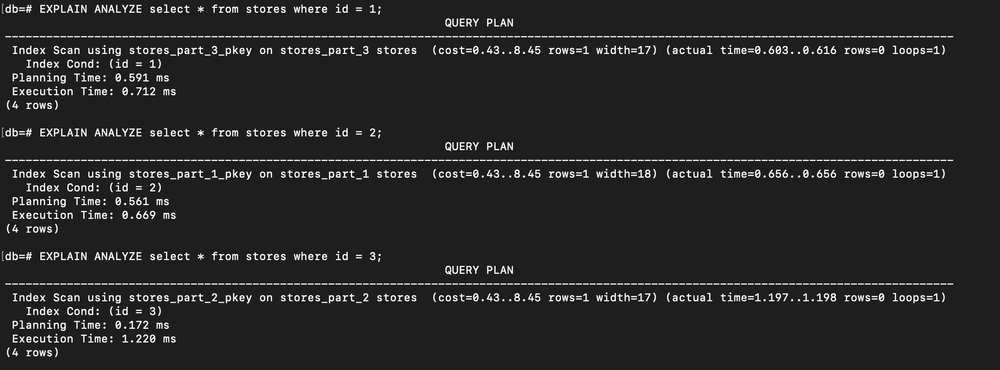

Have you ever faced a situation where you were dealing with a very large dataset and wondered if it could be broken into smaller pieces to improve query performance? I have.

There was a time when the data had grown to hundreds of millions of records, and indexing alone didn’t significantly improve query performance. At that point, the solution to this challenge was `Partitioning`, which can help optimize query execution by allowing the database to scan only the relevant parts of the data.

As stated from the <a href="https://www.postgresql.org/docs/current/ddl-partitioning.html" target="_top"> PosgreSQL Documentation</a>:

> Partitioning refers to splitting what is logically one large table into smaller physical pieces.
These benefits will normally be worthwhile only when a table would otherwise be very large. The exact point at which a table will benefit from partitioning depends on the application, although a rule of thumb is that the size of the table should exceed the physical memory of the database server.

### Partitioning Methods in PostgreSQL
There are 3 partitioning methods that PostgreSQL offers:
1. Range Partitioning
2. List Partitioning
3. Hash Partitioning

Let's break down one by one with the example scenarios.

#### Range Partitioning

> The table is partitioned into “ranges” defined by a key column or set of columns, with no overlap between the ranges of values assigned to different partitions. For example, one might partition by date ranges, or by ranges of identifiers for particular business objects. Each range's bounds are understood as being inclusive at the lower end and exclusive at the upper end. For example, if one partition's range is from 1 to 10, and the next one's range is from 10 to 20, then value 10 belongs to the second partition not the first.

This is the method that I ever implemented. Basically, the data will be divided into several parts based on the specified range.

For the practical purpose, let's just create these tables in our database:
<script src="https://gist.github.com/ameliarahman/82cabd0c015aa3997cd49a1406d98906.js"></script>

Then, seed the table with 30 million records, with dates ranging from January 1, 2020, to December 20, 2024. Note that this process may take some time to complete.
<script src="https://gist.github.com/ameliarahman/1aa95ff3f42f45d53ee6a79d65903ee8.js"></script>

Once finished, let's try to execute this query:
```sql
explain analyze select * from reports where (date >= '2020-01-01' AND date < '2020-06-01');
```
And here is the result:


The time to execute the query is quite long, even the database decides to use `Parallel` in Sequential Scanning.

Now, let's create index on column `date`.
```sql
create index on reports(date);
```

> When creating an index in a production environment, it is better to use the `CONCURRENTLY` option to avoid locking concurrent transactions on the table. This ensures that the table remains accessible for reads and writes during the indexing process by other transactions.

```sql
create index concurrently on reports(date);
```

Let's execute again the query above and see the result:


The execution time is still quite long, and the database continues to use a `Sequential Scan` because the amount of returned data is too large.

Next step:
- Let's create a new partitioned table
- Create partitions from that main table
- Seed them by the data from the `reports` table. 

Here are the steps:

<script src="https://gist.github.com/ameliarahman/9a8b74877931773295a56391682563b3.js"></script>

After all is done, let's try to analyze the query again from `reports_partition` table:
```sql
explain analyze select * from reports_partition where (date >= '2020-01-01' AND date < '2020-06-01');
```


We can observe from the result above that even though the database decides to use a `Sequential Scan`, the execution time is significantly better than before. This improvement is because the database no longer scans the entire dataset; instead, it performs a Seq Scan only on the `relevant partition`(in this case is on `reports_partition_2020`, as shown in the first row of the result).

In addition, we can also directly access the data from the partition itself:

```sql
select * from reports_partition_2020 where (date >= '2020-01-01' AND date < '2020-06-01');
```

Another important note: if we create an index on the main table `reports_partition` using the following command:
```sql
create index concurrently on reports_partition(date);
```
The index will automatically be created on each of the partitions as well, as shown in the image below:




#### List Partitioning
The second method is `List Partitioning`. Quoted from Official PostgreSQL Documentation:

> The table is partitioned by explicitly listing which key value(s) appear in each partition.

This is another partitioning method where we can divide our data based on specific values in a column.

Let's say we have `stores` table that has 3 location data ('Jakarta', 'Sukabumi', 'Bogor'). We can partition the table based on the location column, so that whenever new data is inserted, it will automatically be routed to the specific partition based on the location:

<script src="https://gist.github.com/ameliarahman/a193678c069937c9d37ec0779e22f05b.js"></script>

See what will happen if we execute these queries:
```sql
EXPLAIN ANALYZE SELECT * from stores where location = 'Jakarta';

EXPLAIN ANALYZE SELECT * from stores where location = 'Sukabumi';

EXPLAIN ANALYZE SELECT * from stores where location = 'Bogor';
```

And here is the result:


We can see that the database only scans on the relevant partitions that affect the execution time.

#### Hash Partitioning
> The table is partitioned by specifying a modulus and a remainder for each partition. Each partition will hold the rows for which the hash value of the partition key divided by the specified modulus will produce the specified remainder.

The last partitioning method is `Hash Partitioning`. This method can be particularly useful when we don't have a range or list to partition by.

Let's drop the partitioned table `stores` and re-create again using partitioning by hash:
<script src="https://gist.github.com/ameliarahman/756d36194d325efecc198040eba416e5.js"></script>

- `MODULUS` means that the data will be divided into certain partitions (in this case, there are 3 partitions).
- `REMAINDER` specifies which partition a row will go to based on the hash value created from the value in the partition key.

And if we execute these queries:
```sql
EXPLAIN ANALYZE select * from stores where id = 1;

EXPLAIN ANALYZE select * from stores where id = 2;

EXPLAIN ANALYZE select * from stores where id = 3;
```

The database scans only the specific partitions where the relevant data is stored:



Happy practicing!