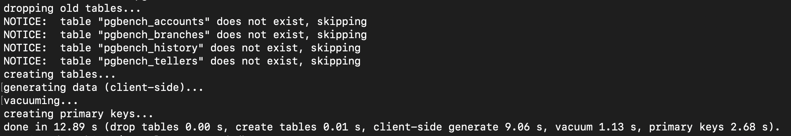
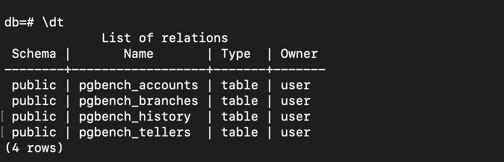
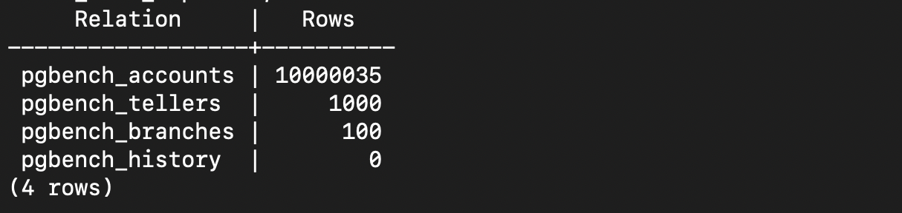
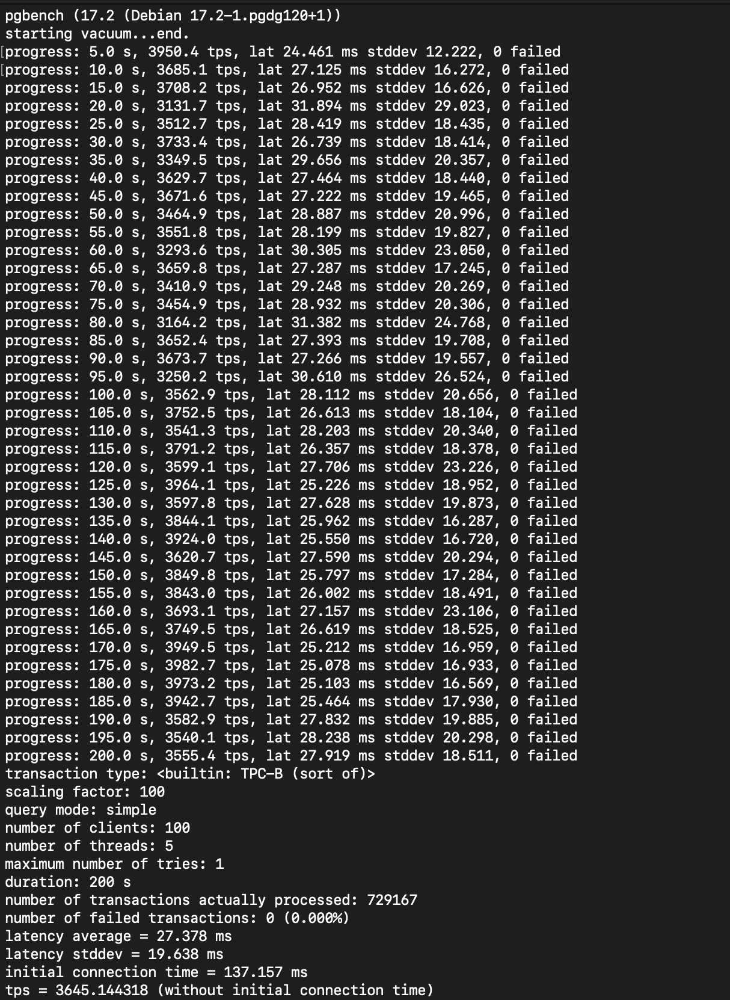
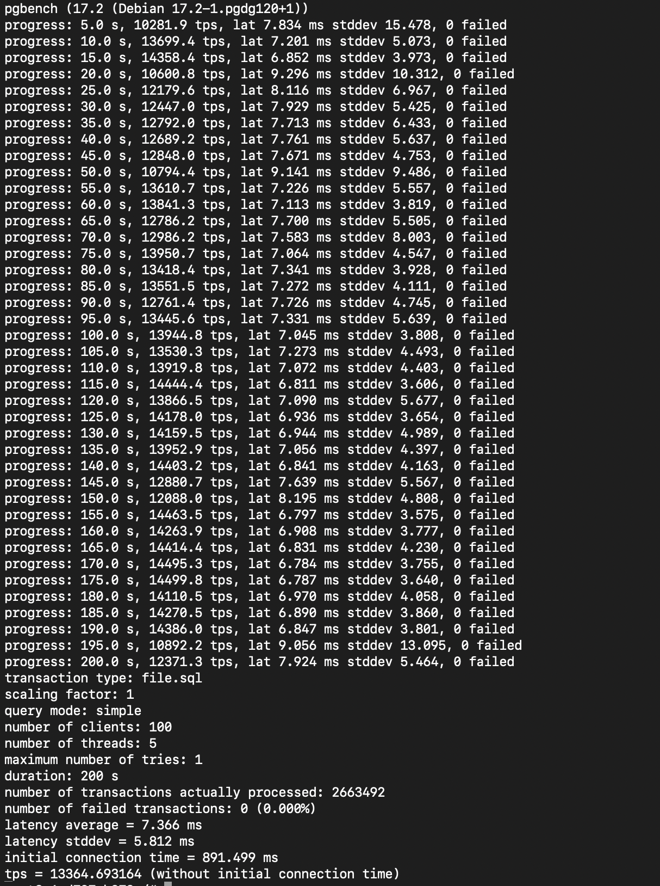
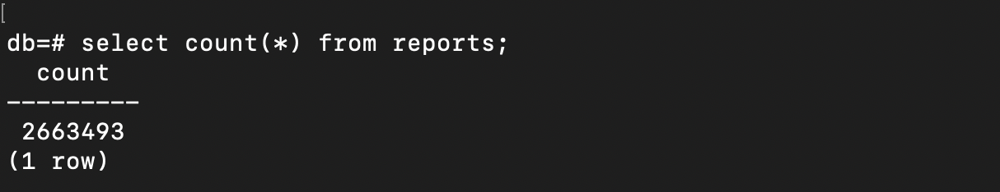

I was curious about how to test and analyze my database, especially the performance of my queries, under the load of concurrent users accessing the database at specific times. If the goal is just to test the execution time of queries and improve performance, we can seed the database with many rows then observe which queries become slower. But what if a query is being accessed simultaneously by many users at once? How can we simulate such a scenario? After researching, I discovered that PostgreSQL includes a tool for this purpose: pgbench.

As stated from <a href="https://www.postgresql.org/docs/current/pgbench.html" target="_top"> PosgreSQL Documentation</a>:

>pgbench is a simple program for running benchmark tests on PostgreSQL. It runs the same sequence of SQL commands over and over, possibly in multiple concurrent database sessions, and then calculates the average transaction rate (transactions per second). By default, pgbench tests a scenario that is loosely based on TPC-B, involving five SELECT, UPDATE, and INSERT commands per transaction. However, it is easy to test other cases by writing your own transaction script files.

As what I get from asking GPT:
>TPC-B, Transaction Processing Performance Council Benchmark is a benchmark used to evaluate the performance of transaction processing systems, like the number of transactions per second that can be processed. Specifically, it's a test designed to simulate the performance of a database system under heavy transaction load.

Let's jump into practice.

First thing first, here's my docker compose to start:
<script src="https://gist.github.com/ameliarahman/18ca7ec9a3169b83f16f6c7df6183100.js"></script>

Go inside the container:
```
docker exec -it postgres_pgbench bash
```

We can make sure that pgbench is automatically included by running this command:
```
which pgbench
```

### Initialization
Before running the benchmark, the tables need to be initialized by pgbench:

```
pgbench -i [ other-options ] dbname
```
Since I already have the database under the name `db` with the user `user`, the full command is below:

```
pgbench -i db -U user
```
- -i means initialization, this command creates 4 default tables to test by pgbench: 
`pgbench_accounts, pgbench_branches,pgbench_history, and pgbench_tellers`, and drop any existing tables of these names.
- By default, this will contain specific rows for each table in scale factor `1`:

    Table               |     Rows
    --------------------|----------------
    pgbench_branches    |  1
    pgbench_tellers     |  10
    pgbench_accounts    |  100000
    pgbench_history     |  0
    
    We can insert more rows by simply adding `-s `(scale factor) option.

And here is the result if I try to execute the command with `-s` option:

```
pgbench -i db -s 100 -U user
```


The created tables on the database:


And how many rows created when scaling up to 100:



### Benchmarking
After the initialization, then what can we do to benchmark our database performance? Here's the example command that we can execute to run scenario of load test the performance (of course there are still many options that we can use referring to official documentation):

```
pgbench -U <user> -d <database> -T <duration_in_seconds> -c <number_of_clients> -j <number_of_threads> -P <number_of_second>
```
- -U: User of database
- -d: The name of database
- -T: Duration in seconds to execute the test
- -c: Simulation number of concurrent clients that access our database. The default is 1.
- -j: Number of worker threads.
- -P: Show progress report every certain seconds/

Let's see what will happen after executing the command:
```
pgbench -U user -d db -T 200 -c 100 -j 5 -P 5
```
 
And here is the result:


Let's break down one by one:
- The first line means the pgbench was starting `vacuum` to clean up dead rows and to optimize the database during the benchmark. <a href="https://www.postgresql.org/docs/current/sql-vacuum.html" target="_top"> Read more about vacuum in postgresql</a>.
- The `progress` line indicates the benchmark situation every 5 seconds.
- Transaction type, as stated above that the `pgbench tests a scenario that is loosely based on TPC-B, involving five SELECT, UPDATE, and INSERT commands per transaction`.
- Scaling factor that I already setted up to 100.
- Query mode for this transaction is simple, meaning pgbench used individual query one at a time.
- Number of client, setted up to 100 concurrent users during the test.
- Number of threads, pgbench used 5 threads to run the test. 
- Maximum number of tries, means each transaction only was attempted once. If a transaction failed, it wouldn't be retried.
- Setting the duration for test to 200 seconds.
- The total of successful transactions during the test.
- The total of failed transactions during the test.
- On average, it took about 27.378 ms to execute each transaction.
- The standart deviation of the latency.
- The time to establish the initial connection.
- Transaction per second, meaning during the test there were 3,645 transactions per second while handling 100 clients with 5 threads.


Now the question is: Can we test specific tables with custom queries, instead of using the default tables and queries provided by pgbench? 

The answer yes. The official Postgresql already mentioned `it is easy to test other cases by writing your own transaction script files`.

And here are the steps:

Let's create another tables on the database and insert random data into `users` table:
<script src="https://gist.github.com/ameliarahman/60aea85763a1fbaf29ab51f8327bfe69.js"></script>

Now, I want to benchmark a query of inserting data to `reports` table:

```sql
INSERT INTO reports (user_id, title, content, created_at, updated_at)
VALUES (
    (SELECT id FROM users ORDER BY RANDOM() LIMIT 1),
    'Title Report' || substring(md5(random()::text), 1, 10),
    'Content for report: ' || substring(md5(random()::text), 1, 100),
    CURRENT_TIMESTAMP,
    CURRENT_TIMESTAMP
);
```

And here's is the command:
```
pgbench -n -f file.sql -U user -d db -T 200 -c 100 -j 5 -P 5
```

- -n means no vacuuming before running the test. The documentation said that `this option is necessary if you are running a custom test scenario that does not include the standard tables pgbench_accounts, pgbench_branches, pgbench_history, and pgbench_tellers`.
- -f means file, the option that we can use to test the specific file, while the file used extension .sql.

Here is the result:


And if we check the `reports` table itself, it now contains as many rows as the number of pgbench transactions (+1 because before running the test, I insert one row manually):

`number of transactions actually processed: 2663492`


Another question that came up to my mind. Can we do it without using file? Yes, we can, simply by utilizing `echo`.

```
pgbench -n -f <(echo "
    INSERT INTO reports (user_id, title, content, created_at, updated_at)
    VALUES (
        (SELECT id FROM users ORDER BY RANDOM() LIMIT 1),
        'Title Report ' || substring(md5(random()::text), 1, 10),
        'Content for report: ' || substring(md5(random()::text), 1, 100),
        CURRENT_TIMESTAMP,
        CURRENT_TIMESTAMP
    );
") -U user -d db -T 100 -c 50 -j 3 -P 5
```

That's it.

There is still much more to explore with pgbench. We can leverage it to identify potential issues, and proactively address them before they become problems.


