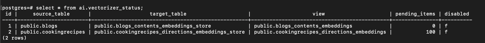
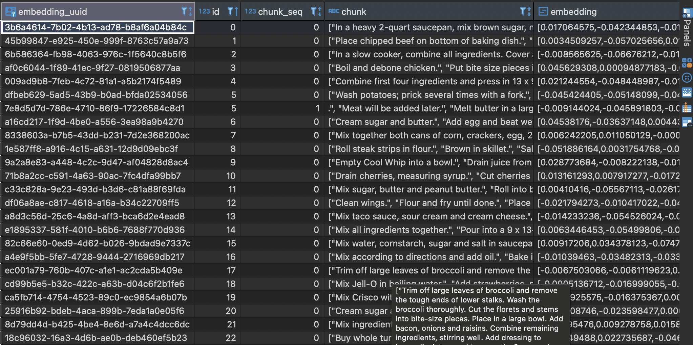
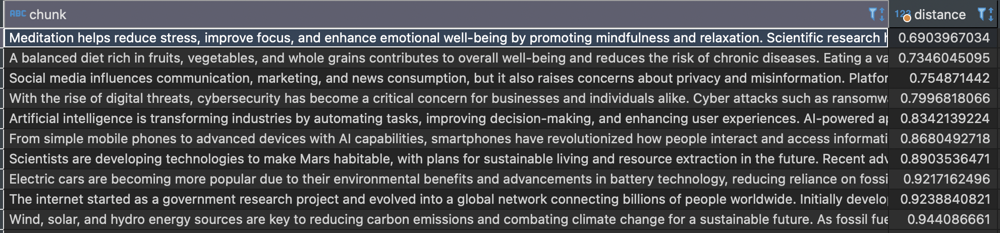

The slogan *"Postgres for everything"* is proving more true every day. The Timescale - a company behind TimescaleDB, the open-source time-series database built on PostgreSQL - has developed **pgai**, a powerfull open-source extension that enables developer to work with machine learning model without having to juggle with multiple tools.

By using **pgai**, we don't need to worry if we are not an AI/ML expert.
This extension can help us to automatically create and synchronize vector embeddings for our data, support Retrieval Augmented Generation (RAG), semantic search, and even allow direct calls to LLMs like OpenAI, Ollama, Cohere, etc by just using simple SQL commands.

The documentation is very easy to follow: <a href="https://github.com/timescale/pgai" target="_top"> Pgai Documentation</a> and here's what I’ve accomplished while exploring **pgai**.

### Getting Started 
First thing first, here is my docker compose file to get started:
<script src="https://gist.github.com/ameliarahman/132c3d6f246f6e6c2fc09728af9cbf6e.js"></script>
Make sure to set the ***OPENAI_API_KEY*** in your .env file. 

I explore the pgai vectorizer with OpenAI following this guide: <a href="https://github.com/timescale/pgai/blob/main/docs/vectorizer/quick-start-openai.md" target="_top"> Quick Start - OpenAI </a>. If you’re interested in trying other tools like Ollama or Voyage, there are quick-start guides available as well!

### Enable extension **pgai**
If we check the extension by using query:
```sql
SELECT * FROM pg_extension;
```

There's still no **ai** extension yet, so we need to create it first:

```sql
CREATE EXTENSION IF NOT EXISTS ai CASCADE;
```
By creating this extension, this also creates new schema named `ai` in our database.

### Create table and seed data in public schema
There are two ways to complete this step:

#### Create table and seed manually

<script src="https://gist.github.com/ameliarahman/f808f72b1b3c9c97aa0dc7f365b7174b.js"></script>

_Note: I ask Chat GPT to give me 10 random data_

#### Use `ai.load_dataset` command

Basically, this command is to load the data from the Hugging Face, so we need the active internet connection to download the datasets from <a href="https://huggingface.co/datasets/" target="_top">here</a>.

You can choose how to load your dataset following <a href="https://github.com/timescale/pgai/blob/main/docs/utils/load_dataset_from_huggingface.md" target="_top">this documentation</a>.

Here's just 1 example how I load the small subset of `CodeKapital/CookingRecipes` datasets:

```sql
SELECT ai.load_dataset('CodeKapital/CookingRecipes', batch_size => 100, max_batches => 1);
```

This command creates new table named `cookingrecipes` and seed 100 data from the Hugging Face.


### Create a vectorizer

```sql
SELECT ai.create_vectorizer(
   'blogs'::regclass,
   destination => 'blogs_contents_embeddings',
   embedding => ai.embedding_openai('text-embedding-3-small', 768, api_key_name=>'OPENAI_API_KEY'),
   chunking => ai.chunking_recursive_character_text_splitter('content')
);
```
- 'blogs'::regclass, refers to the table name `blogs` and regclass is to cast the string `blogs` into a PostgreSQL object identifier (OID). <a href="https://www.postgresql.org/docs/current/datatype-oid.html" target="_top">Read more about Object Identifier Type</a>.
- destination => 'blogs_contents_embeddings', means the destination to store the embeddings will be in a view named `blogs_contents_embeddings`
- embedding => ai.embedding_openai('text-embedding-3-small', 768), means this use OpenAI's `text-embedding-3-small` model to generate `768-dimensional vector embeddings`.
- chunking => ai.chunking_recursive_character_text_splitter('content'), aims to break large text in `content` column into smaller chunks before embedding.

We can check the vectorizer status from the view named `vectorizer_status` in `ai` schema:
```sql
SELECT * from ai.vectorizer_status;
```


Stated from pgai documentation: 
`All the embeddings have been created when the pending_items column is 0. This may take a few minutes as the model is running locally and not on a GPU.`

We can also check the vectorizer worker logs
```
docker logs -f <container_name_or_id>
```


Every 5 minutes, the worker will check the vectorizer for pending tasks and begin processing any queued items.

Once processing is complete, the embeddings will be inserted into the table:


Let's do the same thing for `cookingreceips` table:
```sql
SELECT ai.create_vectorizer(
   'cookingrecipes'::regclass,
   destination => 'cookingrecipes_directions_embeddings',
   embedding => ai.embedding_openai('text-embedding-3-small', 768, api_key_name=>'OPENAI_API_KEY'),
   chunking => ai.chunking_recursive_character_text_splitter('directions')
);
```

_Note: Before executing the command above, I rename the column unnamed to id and add constraint primary key on it_

Here is the vectorizer status:


And here is the embedding result:



An overview of the pgai system can be seen in the image below:

(source: 
<a href="https://www.linkedin.com/feed/update/urn:li:activity:7257016489830961153/" target="_top">Pgai Vectorizer System Overview</a>)

Our source data tables are stored in the `public` schema. Whenever new data is added, it triggers a queued table in the `ai` schema. The worker periodically checks for pending tasks, and if any exist, it processes them by generating vector embeddings based on the specified syntax. Once the embeddings are generated, they are stored in the designated embedding table.

This ensures that whenever new data is inserted into `blogs` or `cookingrecipes` table, the vector embeddings are always automatically created and synchronized in real time.

### Semantic search
Now, let's try to do a semantic search by searching data related to `psychological health` in the `blogs`:

```sql
SELECT
    chunk,
    embedding <=>  ai.openai_embed('text-embedding-3-small', 'psychological health', dimensions=>768) as distance
FROM blogs_contents_embeddings
ORDER BY distance;
```

And here is the result:


The larger the distance, the less relevant the data.

Another example for `cookingrecipes`. Let's try to search `food for winter`:

```sql
SELECT
    chunk,
    embedding <=>  ai.openai_embed('text-embedding-3-small', 'food for winter', dimensions=>768) as distance
FROM cookingrecipes_directions_embeddings cde
ORDER BY distance;
```
Here is the image of partial result:


### RAG


