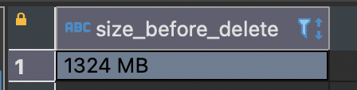
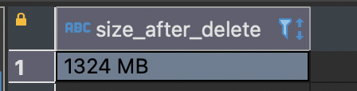
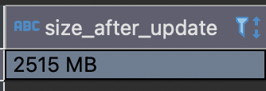
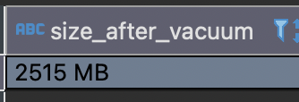
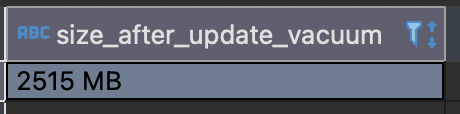
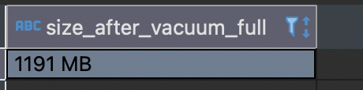
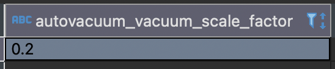

If we have ever worked with large datasets, we are likely familiar with the term `VACUUM`. But what exactly does it do, and how does it help optimize database storage?

According to <a href="https://www.postgresql.org/docs/current/sql-vacuum.html" target="_top"> PosgreSQL Documentation</a>:

> VACUUM reclaims storage occupied by dead tuples. In normal PostgreSQL operation, tuples that are deleted or obsoleted by an update are not physically removed from their table; they remain present until a VACUUM is done. Therefore it's necessary to do VACUUM periodically, especially on frequently-updated tables.

Why is VACUUM necessary?

PostgreSQL uses a Multi-Version Concurrency Control (MVCC) to handle the data. When we have a million records in our database and delete some of them, the deletion process does not immediately free up storage. Instead, the space remains occupied by what's known as `dead tuples`. Same thing happens when updating the data, it's not directly modified the rows, but PostgreSQL will create new version of that rows and keep the old ones. Yes, it will bloat the table as time goes by.

To see how it works, let's jump into practice:

1. Make sure we have postgresql connection ready. Simply up this docker compose setup as usual:

    <script src="https://gist.github.com/ameliarahman/9f30eb741b2f09029796705d722d61cf.js"></script>

2. Create table and seed data:

    ```sql
    CREATE TABLE vacuum_example (
        id SERIAL PRIMARY KEY,
        data TEXT
    )
    ```

    Insert 1000,000 rows:

    ```sql
    INSERT INTO vacuum_example(data)
    SELECT repeat('Test example', 100)
    FROM generate_series(1, 1000000);
    ```

3. Check the size of the table

    ```sql
    SELECT pg_size_pretty(pg_total_relation_size('vacuum_example')) AS size_before_delete;
    ```
    
    - pg_size_pretty: converts a size in bytes expressed as a numeric value into a human-readable format with size units.
    - pg_total_relation_size: total disk space used by the specified table, including all indexes and TOAST data.

    And here is the result:
    

4. Delete a large portion of data

    Let's run this query:

    ```sql
    DELETE FROM vacuum_example WHERE id <= 100000;
    ```

    Then check the size again:
    ```sql
    SELECT pg_size_pretty(pg_total_relation_size('vacuum_example')) AS size_after_delete;
    ```
    

    We can observe that there is no difference in table size before and after a `DELETE` operation. This is because PostgreSQL does not immediately remove the row from disk. Instead, the DELETE query marks the row as what I mention above: `dead tuple`. These dead tuples remain in the table and can lead to table bloat.

5. VACUUM
    
    Those dead tuples can be reclaimed using `VACUUM`. However, as stated in the PostgreSQL documentation, we need to keep in mind that _`plain VACUUM (without FULL) only reclaims space for reuse within the table`_ — it does not shrink the physical size of the table on disk.

    Let's see the example below:

    ```sql
    UPDATE vacuum_example set id = id + 1;
    ```
    The `UPDATE` operation in PostgreSQL basically will copy the rows instead of modifying it. Remember the concept of MVCC (Multi-Version Concurrency Control) in PostgreSQL. When row is updated:
    - The new version will be created.
    - The old version will be kept temporarily for the concurrent transactions.

    So, it will also increase the size:
    

    Now, let's try to VACUUM the table:

    ```sql
    VACUUM vacuum_example
    ```

    As shown below, the table size remains the same because VACUUM does not shrink the table:
    

    However, the previously occupied space is now available for reuse. Let's run the `UPDATE` operation again to prove it:

    ```sql
    UPDATE vacuum_example set id = id + 1;
    ```
    Now, check the table size:
    

    There’s no increase in size like the first update, because PostgreSQL reused the available space.

6. VACUUM [ ( option [, ...] ) ]
    
    There are some options that can we use when doing VACUUM. Two parameters that I tried:

    - `VACUUM FULL`: When we need to reclaim more space. But beware, this operation can cause exclusive locking and takes longer.

    Here is the size after I run `VACUUM FULL vacuum_example`
    

    - `VACUUM ANALYZE`: It's useful to run this operation to update statistical information, especially when the query planner needs up-to-date data to generate efficient execution plans for our query.

7. AUTOVACUUM
    
    Running `VACUUM` manually after many transactions can be a challenge. Fortunately, it's no longer necessary nowadays, since PostgreSQL provides an `autovacuum` feature that can be configured to run automatically.

    ```sql
    SHOW autovacuum;
    ```
    To check whether autovacuum ON or OFF.

    ```sql
    SHOW autovacuum_vacuum_scale_factor;
    ```
    
    It means that autovauum will run when 20% of the table's data has been modified.

    How if a table consists only 1 row? Does the value of 20% apply?
    Actually, PostgreSQL uses both a `scale factor `and a `threshold` to determine when to trigger autovacuum:

    ```sql
    SHOW autovacuum_vacuum_threshold
    ```
    By default it's 50, means that autovacuum will only trigger when the number of modified rows 20% + at least 50 rows: 50 + (0.2 × N) where N is total rows.

<br>
<br>
<br>
<br>

References:
- https://www.postgresql.org/docs/current/sql-vacuum.html
- https://www.postgresql.org/docs/current/routine-vacuuming.html
- https://www.postgresql.org/docs/9.4/functions-admin.html
- Mastering PostgreSQL 17, Hans-Jurgen Schonig


 
