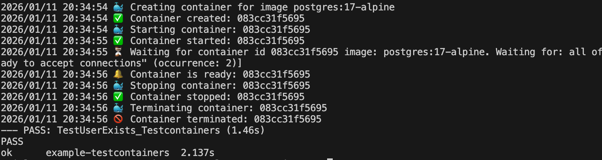

Have you ever struggled with running test of your application? 
I’ve ever spent hours facing the flaky tests, only to realize the problem wasn't my code, it was the test environment. Sometimes, a test passes on my local but fails in CI because of a 'shared' database conflict. Or perhaps you've relied on mocks, only to find they aren't reliable enough to catch the issue.

The answer for those problems is <a href="https://github.com/testcontainers" target="_blank"> Testcontainers</a>. 

Imagine everytime we run a test, a new one, isolated version of our database is created, used, and then instantly destroyed. No more mocks, no more sharing database.

Let's see how it works in go application:

## Initialize Project

Create a new directory and install what is neeeded:
- `go mod init example-testcontainers`
- `go get github.com/jackc/pgx/v5`
- `go get github.com/jackc/pgx/v5/pgconn@v5.8.0`
- `go get github.com/testcontainers/testcontainers-go`
- `go get github.com/testcontainers/testcontainers-go/modules/postgres`

## Create Application Logic

- Create `main.go` file.
- Add example simple logic:

## Create Test Scenario

Let's try to create two ways of testing:

### Without Testcontainers
This is just manual test that I used to do:

### With Testcontainers
And here is the test using testcontainers:

By running the code above, we can see the result like this:

Refers to the documentation:
- First thing first, we need to create a container by specifying the Docker image (in the example I use postgres:17-alpine)
- Configure and specify the username, password and database name for the Postgres container.
- `WaitStrategy` in the code is to determine whether the container is fully ready to use or not.
- `t.Cleanup` that in the end of the test, container will be removed.
- After obtaining the connection, then just write test scenario as we expected.

Can we see the difference?

`Testcontainers` help us to just define our service as a code. Before, we have to rely on a "pre-installed" database, we need to manually config the database and then make sure it is already running before we run the test. Furthermore, the database itself might contain old data from a previous test if we forget to clean up or to destroy the database. By using testcontainers, everything is like a new one and clean at the start of every test.
The documentation also stated that we can reuse the same Postgres Docker container to run mulriple tests in a single file.

It is important to note that `Testcontainers` isn't just for Postgres. Whether you need Redis for caching, Kafka for messaging, or even a specialized search engine like Elasticsearch, the philosophy remains the same. As the official documentation states:
`Testcontainers is a set of open source libraries that provides easy and lightweight APIs for bootstrapping local development and test dependencies with real services wrapped in Docker containers. Using Testcontainers, you can write tests that depend on the same services you use in production without mocks or in-memory services.`

